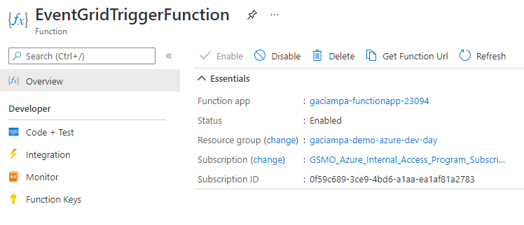
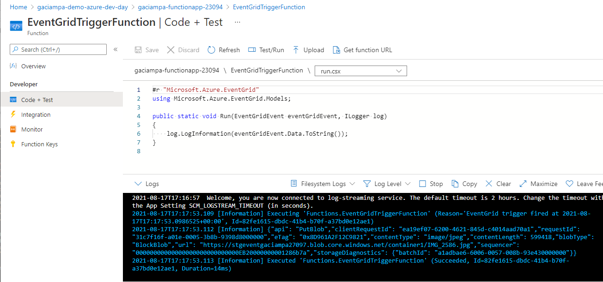
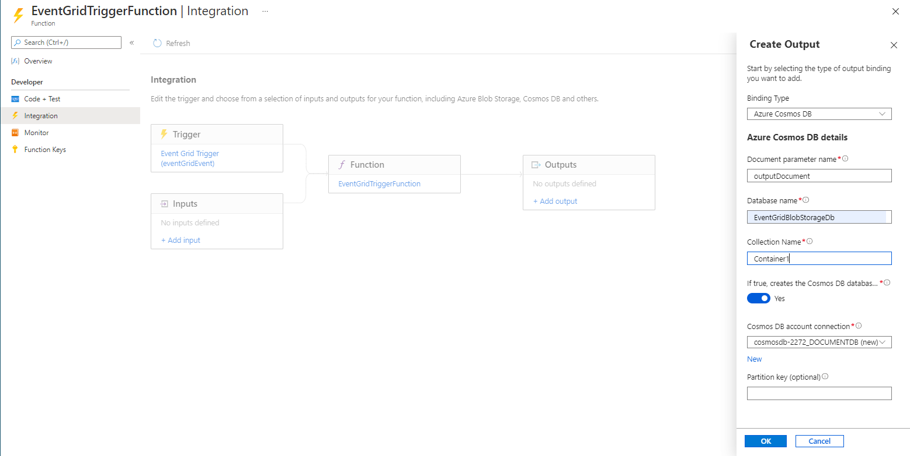

# Azure Dev Day - Serverless Exercise 

<!-- TOC -->
**Overview**: 

- [Requirements](#requirements)
- [Step 1: Setup Azure subscription and properties](#step-1-setup-azure-subscription-and-properties)
- [Step 2: Create an Azure Resource Group ](#step-2-create-an-azure-resource-group)
- [Step 3: Create Cosmos DB resources](#step-3-create-cosmos-db-resources)
- [Step 4: Create Function App](#step-4-create-function-app)
- [Step 5: Create Event Grid](#step-5-create-event-grid)
- [Step 6: Event Grid Blob Storage Test](#step-6-event-grid-blob-storage-test)
- [Step 7: Azure Cosmos DB Output Binding](#step-7-azure-cosmos-db-output-binding)
- [Step 8: Clean up resources](#step-8-clean-up-resources)

<!-- TOC -->


## Requirements

This example assumes the user already has an Azure subscription with contributor access. Additionally, the following services will be required during the lab: 

- Azure CLI, [How to install Azure CLI](https://docs.microsoft.com/en-us/cli/azure/install-azure-cli)
- Git Bash, [Git Download for Windows](https://gitforwindows.org/)

## Step 1: Setup Azure subscription and properties

Initial login and subscription setup is a required prerequisite

````shell
export SUBSCRIPTION_ID=xxxxxxxx-xxxx-xxxx-xxxx-xxxxxxxx

az login 
az account set --subscription $SUBSCRIPTION_ID
````
## Set variable properties for substitution 


````shell
export TAG_PREFIX=<business-unit>

export RESOURCE_GROUP=<$TAG_PREFIX-demo-azure-dev-day>
export REGION=<eastus2>

export COSMOSDB_ACCOUNT_NAME=${TAG_PREFIX}-cosmosdb-$RANDOM
export COSMOSDB_SQL_CONTAINER=sql-container-$RANDOM
export COSMOSDB_SQL_DATABASE=sql-database-$RANDOM

export STORAGE_ACCOUNT_FUNC=stgfunc${TAG_PREFIX}${RANDOM}
export STORAGE_ACCOUNT_EVENT=stgevent${TAG_PREFIX}${RANDOM}

export FUNCTION_APPNAME=${TAG_PREFIX}-functionapp-${RANDOM}
````

NOTE: The region location of the resource group may be different than the physical azure resources 

## Step 2: Create an Azure Resource Group 

[Create Azure Resource Group](https://docs.microsoft.com/en-us/cli/azure/group?view=azure-cli-latest#az_group_create) use the following command line:

````shell
az group create --name $RESOURCE_GROUP --location $REGION --tags $TAG_PREFIX 
````
  
## Step 3: Create Cosmos DB resources

Creating a Cosmos DB may be accomplished via the [Azure Portal](https://docs.microsoft.com/en-us/azure/cosmos-db/create-cosmosdb-resources-portal), or via the [Azure CLI](https://docs.microsoft.com/en-us/azure/cosmos-db/cli-samples).

````shell
az cosmosdb create --name $COSMOSDB_ACCOUNT_NAME --resource-group $RESOURCE_GROUP --tags $TAG_PREFIX 
````
 
 
## Step 4: Create Function App  


### Step 4A: Create storage account function app

Creating a storage account and function app via the [Azure Portal](https://portal.azure.com), or via the [Azure CLI](https://docs.microsoft.com/en-us/azure/azure-functions/scripts/functions-cli-create-serverless).

````shell 
# Create storage account and function app service 
az storage account create --name $STORAGE_ACCOUNT_FUNC --location $REGION --resource-group $RESOURCE_GROUP --sku Standard_LRS --tags $TAG_PREFIX 

### Step 4A: Create Function App service (function app service is a placeholder for the event grid function, created in next steps)

az functionapp create --name $FUNCTION_APPNAME  --storage-account $STORAGE_ACCOUNT_NAME \
	--consumption-plan-location $REGION \
	--resource-group $RESOURCE_GROUP --functions-version 2 --tags $TAG_PREFIX
````

## Step 5: Create Event Grid 

In this step, a blob storage account will be created, and then an event grid endpoint to the previously created Function App 
- Create blob storage account
- Create event grid to function app endpoint 

### Step 5A: Create storage account for event grid, Azure Fuction and Event Grid

````shell 
# Create storage account and function app service 
az storage account create --name $STORAGE_ACCOUNT_EVENT --location $REGION --resource-group $RESOURCE_GROUP --sku Standard_LRS --tags $TAG_PREFIX 
````

**NOTE: Switch to the Azure Portal for the remaining steps in the execise.** 

### Step 5B Create function to receive event grid events 

Navigate the the resource group created previously, select the function app, and create a new function. 

- Development Environment: **Develop in portal**
- Template: **Azure Event Grid trigger** 
- Template details, New Function: **EventGridTriggerFunction** 
- Create

Navigate within the function app, verify function is **Enabled** 

 

### Step 5C: Create event grid topic and function to process blob storage events 

Navigate to the resource group created previously, select the **event grid storage account**, **Events**  icon to create an event grid topic and link to the function app. 

- Verify the **Topic Type** and **Source Resource* match the **stgevent....** resource created previously 
- Select:  **Event Subscription** 
- Name: **BlobEventGridToFunctionApp** 
- Event Schema: **Event Grid Schema** 
- System Topic Name: **BlobEventGridToFunctionAppTopic**
- Event Types Filter: **default 2 selected, or as desired** 
- Endpoint Type: **Azure Function** 
- Endpoint: **select endpoint** (navigate and select the desired FunctionApp and Function> 

 


**EventGridTriggerFunction\run.csx** will be created with the following properties: 

````shell
#r "Microsoft.Azure.EventGrid"
using Microsoft.Azure.EventGrid.Models;

public static void Run(EventGridEvent eventGridEvent, ILogger log)
{
    log.LogInformation(eventGridEvent.Data.ToString());
}
````


## Step 6: Event Grid Blob Storage Test

Current status is the following have been created and ready for testing: 

- Azure Blob storage account 
- Event Grid Topic for stoage account changes  
- Function App to receive and log events 

Next step is to create an blob container, upload files and verify the event grid triggers in the function app 

- Navigate to the storage accouint
- Select: **Blob containers**, **+ Add Container**
- Name: **container1**, 
- Access level: **default** or **as desired** 
- Create 

Open a second browser session in the Azure Portal:
- Session 1: Navigate to the newly created **Blob container1**
- Session 2: Navigate to the Function App, **EventGridTriggerFunction**, and open the **Logs** menu, to view the function application log 
- **Blob container**, select **Upload**, upload a favorite file, image or related media:

 

-  **EventGridTriggerFunction**, observe for each image, the event grid will trigger an fuction instance, **Logs** will reflect the event grid trigger content: 

 


## Step 7: Azure Cosmos DB Output Binding

The next step in the modern application architecture is to push a record of the blob event grid action to **Cosmos DB** for subsequetn downstream processing. Adding Cosmos DB requires two steps: 

- Adding an **Output Binding** to the **EventGridTriggerFunction**
- Updating the  **EventGridTriggerFunction** function to emit the events into Cosmos DB 

Navigate to the **EventGridTriggerFunction**, select **Integration** and **Add output**: 
- Binding Type: **Azure Cosmos DB**
- Document parameter name: **outputDocument** (case sensitive and must match the outputDocument property in the function 
- Database name: **EventGridBlobStorageDb** (as desired)
- Colleciton name: **Container1** (as desired) 
- If true, ..: **Yes** 
- Cosmos DB account connection: **select Cosmos DB account created earlier**  


 


**EventGridTriggerFunction\run.csx** with **outputDocument** set to emit to Cosmos DB output binding: 

````shell
#r "Microsoft.Azure.EventGrid"
using Microsoft.Azure.EventGrid.Models;


[FunctionName("EventGridTrigger1")]
public static void Run(EventGridEvent eventGridEvent,  out  object outputDocument, ILogger log)
{
    log.LogInformation(eventGridEvent.Data.ToString());
    outputDocument = eventGridEvent.Data; 

}

````

## Step 8: Clean up resources 

Do NOT forget to remove the resources once you've completed the exercise, [Azure Group Delete](https://docs.microsoft.com/en-us/cli/azure/group?view=azure-cli-latest#az_group_delete)

```shell
 az group delete --name $RESOURCE_GROUP --yes
```
